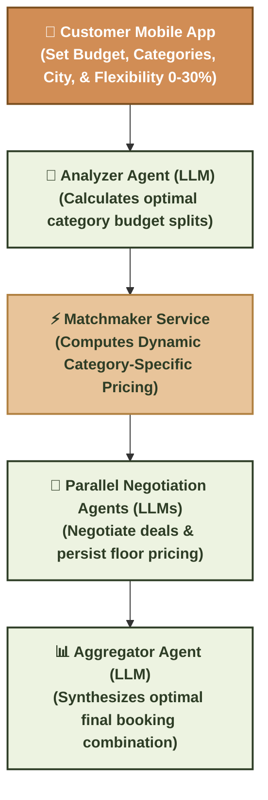
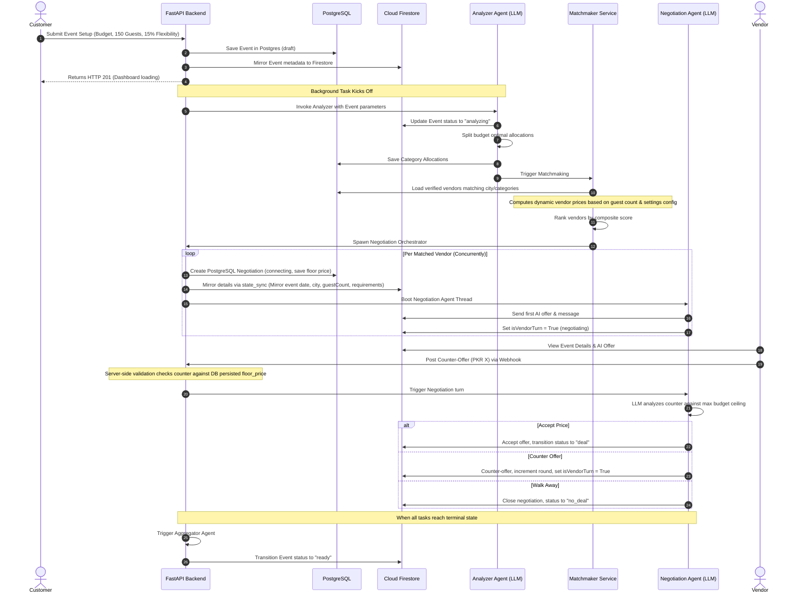

# EventFlow 🎉 — AI-Powered Event Planning & Negotiation Platform

EventFlow is a premium, state-of-the-art mobile application and backend ecosystem that automates budget allocation, vendor matchmaking, and real-time negotiations using a **Multi-Agent LLM System**. By using parallel specialized AI agents, EventFlow acts as a digital event coordinator that negotiates the best deals on behalf of the customer, while offering vendors a clear, detail-rich interface to review requests, propose counters, and close bookings.

---



---

## 🌟 Visual Overview & Architecture

### The Multi-Agent Orchestration Pipeline


---

## ⚡ Core Architectural Capabilities

### 1. Dynamic Category-Specific Pricing
Instead of using flat listed prices, EventFlow calculates the baseline pricing for vendors based on custom configurations:
* **Catering**: Per-person rate calculation (`base_rate * guest_count`).
* **Decoration**: Lump sum base price scaled by `1.25` for `Outdoor` venue settings, and `+5%` for every 100 guests exceeding a baseline threshold.
* **Tent / Marquee**: Marquee base cost + per-head seating rental (e.g. `300 PKR * guest_count`).
* **Flowers**: Base flower setup scaled proportionally by guest count tables.
* **Others**: Flat pricing.

### 2. Double-Layer Validation Safeguards
To secure transactions and maintain business constraints, counter-offers are verified at two levels:
* **Client-side**: Flutter checks proposals before submission (scaling minimum price by guest counts for Caterers).
* **Server-side**: API webhooks validate offers directly against the PostgreSQL-persisted `floor_price` (computed once during matchmaking). Any attempts to bypass client checks fail instantly with `HTTP 400 Bad Request`.

### 3. Negotiation Flexibility Ranges
Customers can configure a **Flexibility Range (0% to 30%)** on their budget screens. This flexibility directly dictates the AI negotiator's cap:
$$\text{Max Budget Cap} = \min\left(\text{Allocated Category Budget} \times (1 + \text{Flexibility}),\ \text{Explicit User Max Ceiling}\right)$$
The agent will push prices down to the target split, but has the authority to go up to the flexibility margin to close a deal with premium vendors.

---

## 📖 End-to-End Walkthrough Example

### 1. Customer Submits Event
* **Event**: Wedding
* **Location**: Lahore
* **Budget**: PKR 500,000
* **Guests**: 150
* **Venue Setting**: Outdoor
* **Negotiation Flexibility**: 15%
* **Selected Categories**: `Caterer`, `Decorator`

### 2. The Analyzer Split
The Analyzer Agent evaluates the event details and saves the splits:
* **Caterer Allocation**: PKR 350,000
* **Decorator Allocation**: PKR 150,000

### 3. Matchmaker Computes Dynamic Base Prices
* **Nadeem Caterers** is matched:
  * Profile base per-head rate = `PKR 2,000` / min floor rate = `PKR 1,500`
  * **Dynamic Asking Price** = $2000 \times 150 = \text{PKR 300,000}$
  * **Dynamic Floor Price** = $1500 \times 150 = \text{PKR 225,000}$
* **Al-Faisal Decor** is matched:
  * Profile base flat rate = `PKR 100,000` / min floor rate = `PKR 80,000`
  * Venue multiplier (Outdoor) = `1.25x`
  * Size multiplier (150 guests) = $1.0 + (50 / 100 \times 0.05) = 1.025x$
  * **Dynamic Asking Price** = $100000 \times 1.25 \times 1.025 = \text{PKR 128,125}$
  * **Dynamic Floor Price** = $80000 \times 1.25 \times 1.025 = \text{PKR 102,500}$

### 4. Orchestrator Ceilings & Negotiations
* **Nadeem Caterers Negotiation**:
  * Budget Allocated: PKR 350,000.
  * Max Budget Ceiling: $350000 \times (1 + 0.15) = \text{PKR 402,500}$.
  * Since asking price (PKR 300,000) is well below the ceiling, the Negotiation Agent immediately accepts the deal!
* **Al-Faisal Decor Negotiation**:
  * Budget Allocated: PKR 150,000.
  * Max Budget Ceiling: $150000 \times (1 + 0.15) = \text{PKR 172,500}$.
  * The agent starts negotiations by countering at PKR 120,000. The vendor can manual counter back inside the app, validated securely by the backend.

---

## 🛠️ Project Structure
```
├── backend/
│   ├── alembic/                # DB schema version migrations
│   ├── app/
│   │   ├── agents/             # AI prompt files, fireworks LLM clients, and agent code
│   │   ├── models/             # SQLAlchemy ORM Models (Postgres schema)
│   │   ├── routers/            # Web REST API route handlers
│   │   ├── services/           # State Sync helpers, Matchmaker, and Calculator services
│   │   └── config.py           # Multipliers configuration class
│   ├── scripts/                # Database seed, cleanup, and integration tests
│   └── tests/                  # Pytest unit tests for pricing formulas
├── docs/                       # In-depth architectural & API references
├── lib/
│   ├── models/                 # Dart domain models
│   ├── providers/              # Riverpod State controllers
│   ├── screens/                # Flutter screen UI files
│   └── services/               # Firestore listener and backend services
```

---

## ⚡ Development & Deployment Setup

### 1. Configure Firebase Credentials
Verify you have active Firebase CLI tools logged in, then generate client options:
```bash
flutterfire configure --project=amdhack-aa788
```
This automatically updates `lib/firebase_options.dart` and `android/app/google-services.json`.

### 2. Set Up the Backend & Database
1. Create a `backend/.env` file with your database URLs, Firebase service credentials, and Fireworks AI api keys.
2. Install Python packages:
   ```bash
   cd backend
   poetry install
   ```
3. Run Alembic database migrations:
   ```bash
   poetry run alembic upgrade head
   ```
4. Seed verified vendors:
   ```bash
   poetry run python scripts/seed_vendors.py
   ```
5. Start the local server:
   ```bash
   poetry run uvicorn app.main:create_app --app-dir backend --host 0.0.0.0 --port 8000 --reload
   ```

### 3. Run the Mobile App
From the root directory:
```bash
flutter pub get
flutter run
```

---

## 🚀 Deploying to Render (Production)
You can deploy the EventFlow backend directly to Render's native Python environment using GitHub connection:

### 1. Prepare Firebase Service Account
On Render, we don't upload the credentials file directly. Instead, we use a base64 environment variable:
* Convert your `firebase-service-account.json` to base64 string:
  * **Windows (PowerShell)**: `[Convert]::ToBase64String([IO.File]::ReadAllBytes("firebase-service-account.json"))`
  * **macOS/Linux (Terminal)**: `base64 -i firebase-service-account.json`
* Copy the resulting long text string.

### 2. Deploy on Render
1. Create a Render account at [render.com](https://render.com).
2. Click **New +** > **Blueprint**.
3. Connect your GitHub repository containing this project.
4. Render will automatically detect the `render.yaml` file at the root, recognize it as a **Python Web Service** with `rootDir: backend`, and load the settings.
5. Provide values for the required environment variables:
   * `DATABASE_URL`: Your Supabase connection string.
   * `DIRECT_DATABASE_URL`: Supabase connection string (used for running Alembic migrations).
   * `FIREWORKS_API_KEY`: Your Fireworks developer key.
   * `FIREBASE_SERVICE_ACCOUNT_JSON`: The base64 string you generated in Step 1.
6. Click **Approve** to deploy!

### 3. Run Database Migrations in Release Stage
Render allows you to run database migrations automatically before starting your web service container. Under your service's settings on the Render Dashboard, configure:
* **Build Command**: `pip install -r requirements.txt`
* **Release Command**: `alembic upgrade head`
* **Start Command**: `uvicorn app.main:create_app --host 0.0.0.0 --port $PORT`

---

## 🧪 Testing & Validation

### Backend Unit Tests
Run the pytest suite to verify dynamic category calculations:
```bash
cd backend
poetry run pytest -v
```

### End-to-End Pipeline Test
Simulates the complete backend pipeline (Event submission, AI analysis, vendor matching, negotiations, deal logging, and aggregator compilation):
```bash
cd backend
poetry run python scripts/test_e2e_events.py
```
