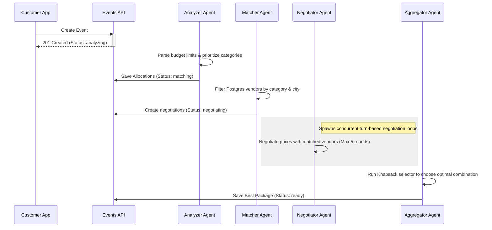

# Architecture, Data Syncing, & AI Multi-Agent Pipeline

EventFlow ensures data consistency by combining a robust relational Postgres database with a real-time Firestore layer.

---

## 1. Database Schema (PostgreSQL)

We use PostgreSQL for transaction integrity. Key tables include:

* **`users`**: Auth account records mapping Firebase UIDs to roles (`customer` | `vendor`).
* **`vendors`**: Profiles containing listed price, rating, verification, and `firebase_uid`.
* **`events`**: Tracks budgets, selected cities, date, status (`analyzing`, `matching`, `negotiating`, `ready`, `booked`), and the AI's budget allocations.
* **`event_vendor_allocations`**: Holds category-specific caps generated by the Analyzer.
* **`negotiations`**: High-level negotiation state, including round details, current offer, final deal price, and lock status.
* **`bookings`**: Stores final accepted transactions linking packages to events.
* **`llm_usage_log`**: Logs tokens, latency, cost, and errors for auditing AI expenses.

---

## 2. Real-Time Synchronization Engine

To avoid data drift between PostgreSQL and Firestore, EventFlow follows a strict **"Write to Postgres, Mirror to Firestore"** workflow.

All status changes must pass through the `state_sync.py` module:
```python
# app/services/state_sync.py
async def update_event_status(db: AsyncSession, event_id: uuid.UUID, status: str, ...):
    # 1. Update Postgres (Primary Authority)
    # 2. Mirror status change to Firestore events/{eventId}
```
Firestore security rules enforce role-based access:
* Customers can only read negotiations matching `resource.data.customerFirebaseUid`.
* Vendors can only read/update negotiations matching `resource.data.vendorFirebaseUid`.

---

## 3. Multi-Agent AI Pipeline

When an event is planned, `_run_full_pipeline` initiates the background multi-agent sequence:



### A. Step 1: Analyzer Agent
* **Role**: Parses constraints (guests, date, indoor/outdoor preferences).
* **LLM Prompt**: Generates a JSON allocating budget slices across relevant categories (e.g., spending more on catering for large guest counts) and saving reasoning logs.

### B. Step 2: Matcher Agent
* **Role**: SQL query matching verified vendors in the chosen city whose list price falls near or below the cap.

### C. Step 3: Negotiator Agent
* **Role**: Performs turn-based negotiation.
* **Mechanism**: Runs turn loops concurrently. On each turn, the agent evaluates the vendor's counter-offer (or list price) against the category's budget cap, generating conversational offers until a deal is locked or negotiations time out (max 5 rounds).

### D. Step 4: Aggregator Agent
* **Role**: Solves the bounded knapsack problem.
* **Mechanism**: Collects all completed "deal" price agreements and selects the best vendor combination that yields maximum savings while staying under the customer's total budget.
