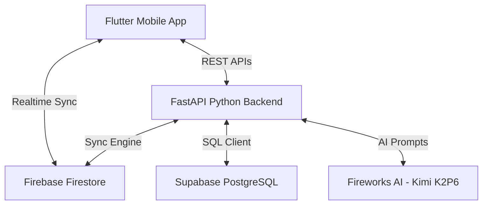

# EventFlow — AI-Powered Event Management & Negotiation Platform

EventFlow is a premium, dual-role mobile application that simplifies event planning and vendor booking. It automates budget allocation and vendor negotiations using multi-agent LLM systems, providing a seamless experience for both Customers and Vendors.

---

## Key Features

### 👤 For Customers (Users)
* **AI Event Setup**: Choose an event type, date, guest count, city (Islamabad, Lahore, Karachi, Rawalpindi), and total budget.
* **Automatic Budget Allocation**: AI analyzer evaluates the event type and distributes the budget realistically across necessary service categories (e.g., Caterer, Decorator, Photographer).
* **Live AI Negotiation Dashboard**: Watch AI negotiators engage with matched vendors in real-time, working to secure the best package prices.
* **Aggregated Packages**: Compare the final negotiated packages, view savings percentage vs. original vendor listed prices, and book the entire package with a single tap.
* **Profile Management**: Manage profile name and review past event history.

### 🏪 For Vendors (Service Providers)
* **Onboarding & Pricing**: Set up business name, category, city, base prices (minimum floor & maximum listing), and define unavailable dates.
* **Interactive Negotiation Loop**: Respond to automated AI offers (accept, counter-offer, or reject) directly from the app.
* **Frictionless Bookings**: Track locked deals, past orders, and upcoming events in the calendar.

---

## System Architecture

### 1. Frontend Layer (Flutter + Riverpod)
* **State Management**: Enforced using Riverpod for clean, reactive data streams.
* **Realtime Listener**: Streams negotiation progress and event updates in real-time from Firestore.
* **Responsive Layouts**: Premium, clean design built with customized styling tokens (e.g., glassmorphism gradients and custom animations) supporting both English and Urdu localizations.

### 2. Backend Layer (FastAPI)
* **Auth Verification**: Firebase JWT middleware validates requests on all secure API endpoints.
* **Database**: PostgreSQL (Supabase) acts as the relational single-source-of-truth for users, events, and bookings.
* **Realtime Synchronization**: A dual-write sync engine (`state_sync.py`) propagates PostgreSQL state changes to Firestore instantly.

### 3. Multi-Agent Negotiation Pipeline
When a customer creates an event, the system kicks off a 4-step pipeline:
1. **Analyzer Agent**: Evaluates constraints, prioritizes categories, and splits the total budget.
2. **Matcher Agent**: Finds verified, available vendors in PostgreSQL matching the location and category.
3. **Negotiator Agents**: Spawns concurrent, turn-based LLM negotiation loops between the customer representative and each matched vendor.
4. **Aggregator Agent**: Synthesizes the final deals into the most optimal, budget-compliant package combinations.
